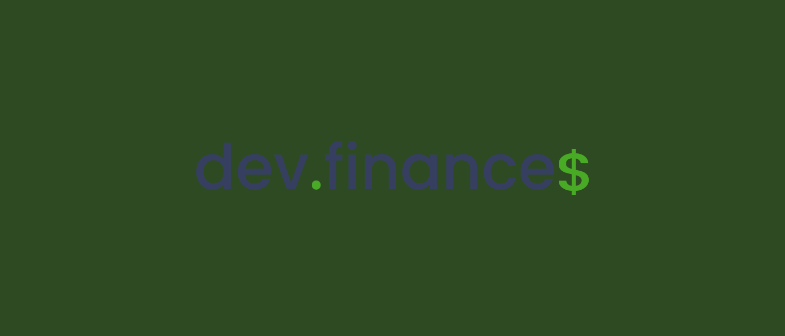
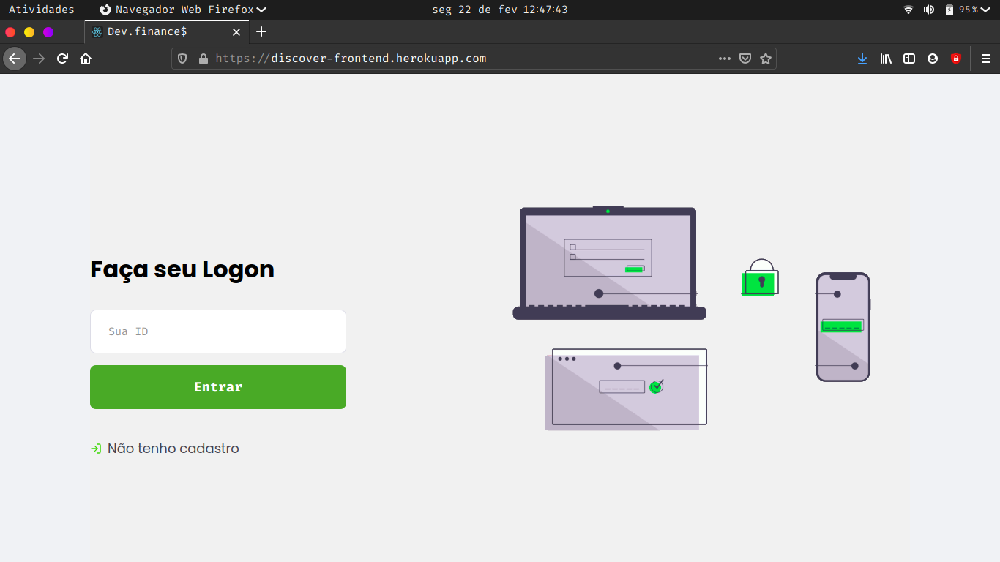
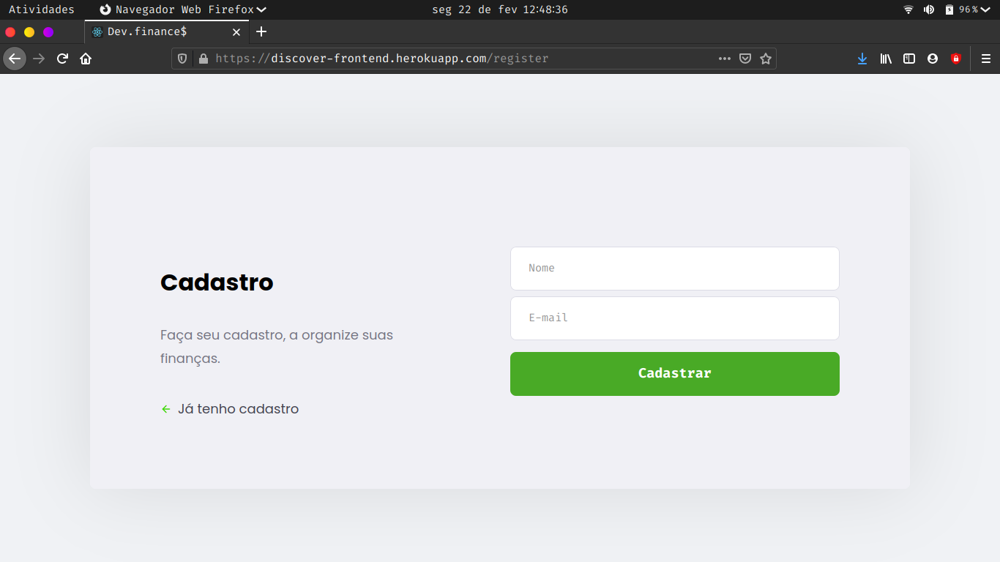
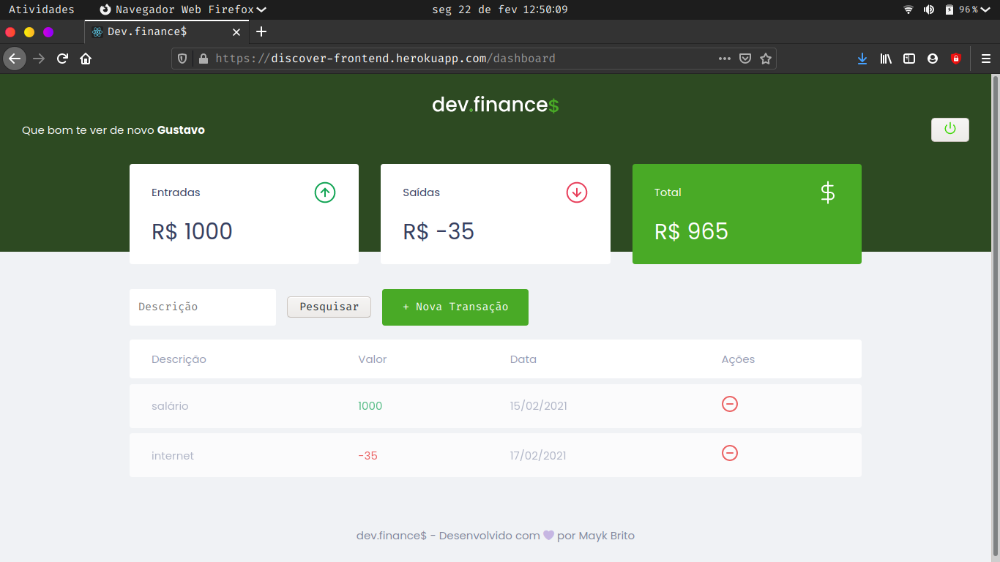

  

  

  
  
  
    
   
   

  
  
  
  
 

<h1 align="center">
    
</h1>

<h4 align="center"> 
	🚧  Dev.finance$ 💲️ Concluído 🚀 🚧
</h4>

 <a href="#-sobre-o-projeto">Sobre</a> •
 <a href="#-funcionalidades">Funcionalidades</a> •
 <a href="#-layout">Layout</a> • 
 <a href="#-como-executar-o-projeto">Como executar</a> • 
 <a href="#-tecnologias">Tecnologias</a> • 
 <a href="#-contribuidores">Contribuidores</a> • 
 <a href="#-autor">Autor</a> • 
 <a href="#user-content--licença">Licença</a>

## 💻 Sobre o projeto

💲️ Dev.finance$ - é uma forma de organizar suas despesas e ganhos, tudo em um único lugar com um visual bem agradável.

Projeto desenvolvido durante a **Maratona Discover** oferecida pela [Rocketseat](https://maratonadiscover.rocketseat.com.br/inscricao).
A maratona discover é uma experiência online para quem está começando a estudar programação, e quer conhecer esse fantástico
mundo em torno de novas tecnologias.
---

## ⚙️ Funcionalidades

- [x] Cadastro de conta:
  - [x] seu nome
  - [x] seu e-mail
  - [x] e o endereço para que ele possa aparecer no mapa
  - [x] pesquisa por lançamento
  - [x] saldo total de lançamentos
  - [x] saldo total de despesas
  - [x] saldo total de receitas
  - [x] logout
---

## 🎨 Layout

O layout da aplicação está disponível no Figma:

### Web

  

  

  

---

## 🚀 Como executar o projeto

Este projeto é somente o frontend

💡Se você executar em localhost, precisará do backend do projeto [BACKEND](https://github.com/GusMartins499/backend-discover2.0-heroku).

### Pré-requisitos

Antes de começar, você vai precisar ter instalado em sua máquina as seguintes ferramentas:
[Git](https://git-scm.com), [Node.js](https://nodejs.org/en/). 
Além disto é bom ter um editor para trabalhar com o código como [VSCode](https://code.visualstudio.com/)

## 🛠 Tecnologias

As seguintes ferramentas foram usadas na construção do projeto:

#### **Website**  [React](https://reactjs.org/)

-   **[React Router Dom](https://github.com/ReactTraining/react-router/tree/master/packages/react-router-dom)**
-   **[React Icons](https://react-icons.github.io/react-icons/)**
-   **[Axios](https://github.com/axios/axios)**

> Veja o arquivo  [package.json](https://github.com/tgmarinho/frontend-discover2.0-heroku/blob/master/web/package.json)

#### **Utilitários**

-   Protótipo:  **[Figma](https://www.figma.com/)**  →  **[Protótipo (Dev.finance$)](https://www.figma.com/file/7Vu9DzUaCZIV4nibzkjgB4/dev.finance%24-Maratona-Discover?node-id=0%3A1)**
-   Editor:  **[Visual Studio Code](https://code.visualstudio.com/)**
-   Markdown:  **[StackEdit](https://stackedit.io/)**
-   Teste de API:  **[Insomnia](https://insomnia.rest/)**
-   Ícones:  **[Feather Icons](https://feathericons.com/)**
-   Fontes:  **[Poppins](https://fonts.google.com/specimen/Poppins)**

---

## 🦸 Autor

<a href="https://www.instagram.com/gustavos_m/">
 
  
 <b>Gustavo Martins</b></a> <a href="https://www.instagram.com/gustavos_m/" title="instagram">🚀</a>
  

---

## 📝 Licença

Este projeto esta sobe a licença [MIT](./LICENSE).

## Créditos ao autor do template

Feito com ❤️ por Thiago Marinho 👋🏽 [Entre em contato!](https://www.linkedin.com/in/tgmarinho/)

---

##  Versões do README

[Português 🇧🇷](./README.md)  |  [Inglês sem emojis 🇺🇸](./README-en.md) | [Portugues sem logo  🇧🇷](./README-sem-logo.md) 